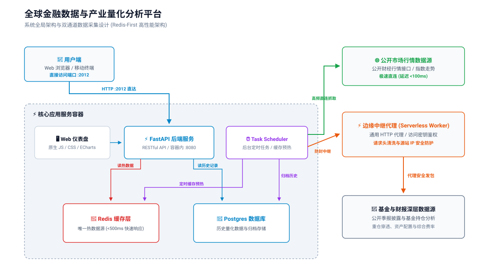

# X-Analytics

全球科技与 AI 产业周期终端 / 金融数据分析平台，基于 [FastAPI](https://fastapi.tiangolo.com/) 与 [AKShare](https://github.com/akfamily/akshare) 构建。

---

## 🏗️ 全局项目架构与三库联动



<details>
<summary><b>📐 展开查看 Mermaid 流程图源码</b></summary>

```mermaid
graph TD
    Client["📱 用户浏览器 / 移动端"] -->|访问 /analytics| Nginx Gateway["🛡️ Nginx 网关 (x-actions)"]
    Nginx Gateway -->|反向代理 :8080| App["⚡ FastAPI Backend (x-analytics)"]
    
    subgraph x-analytics ["核心应用 (x-analytics)"]
        App -->|静态资源| WebUI["📱 Web 仪表盘 (Vanilla JS/CSS)"]
        App -->|读请求 (500ms)| Redis["🔴 Redis Cache (Single Source of Truth)"]
        App -->|历史存取| Postgres["🐘 Postgres DB"]
        
        Scheduler["⏰ Task Scheduler (Background)"] -->|定时抓取/预热| ExternalAPIs["🌐 外部 API (AkShare/Sina/EastMoney)"]
        Scheduler -->|写缓存| Redis
        Scheduler -->|写历史| Postgres
    end

    ExternalAPIs -.->|代理防护中继| ProxyWorker["⚡ Cloudflare Worker (x-worker)"]
```

</details>

本平台由 3 个关联仓库协同联动组成：
- **`x-analytics`**（本仓库）：核心应用服务，包含 FastAPI 后端、前端 Web 仪表盘、后台 Task Scheduler 数据抓取与 Redis 缓存管理。
- **[`x-actions`](https://github.com/XERA-2011/x-actions)**：基础设施与部署编排中心，提供 Nginx 网关反向代理、Docker Compose 容器编排与 CI/CD 自动化部署。
- **[`x-worker`](https://github.com/XERA-2011/x-worker)**：Cloudflare Worker 通用代理中继，防护数据抓取时的源站 IP 安全。

---

## 📊 五大核心模块

1. **全球市场**：亚洲市场（沪深/港股动能、估值水位）、美股及西方市场动能与对标。
2. **AI 产业链**：全球 7 层产业链结构监测、中美竞争力对比、泡沫风险温度计。
3. **有色金属**：黄金、白银、铜、铝等大宗商品价格趋势与数据监测。
4. **ETF 市场**：国内主流 ETF 实时行情与资金流向。
5. **QDII 基金**：纳斯达克100 & 标普500 场外 A类基金对标、季报真实资产配置/持仓与综合费率监测。

---

## 📡 API 接口

完整 Swagger UI 接口文档：`/analytics/docs`

> 生产环境通常配合网关项目部署，由 Nginx 将 `/analytics/` 反向代理到后台服务，并剥离 `/analytics` 前缀。本地运行直接访问根路径。

---

## 🛠️ 本地开发与运行

### 方式一：Python 源码启动 (推荐开发使用)

#### 1. 环境准备 (虚拟环境)
```bash
# 创建虚拟环境
python -m venv .venv

# 激活环境 (Mac/Linux)
source .venv/bin/activate
# Windows (PowerShell):
# .\.venv\Scripts\Activate.ps1

# 安装依赖
pip install -r requirements.txt
```

#### 2. 配置环境变量
在项目根目录新建 `.env.local` 文件，填入配置：

```env
REDIS_URL="redis://:Redis密码@<YourServerIP>:6379/0"
DATABASE_URL="postgres://postgres:数据库密码@<YourServerIP>:5432/xanalytics"

# Cloudflare Worker 中继代理配置 (用于数据抓取防封)
CF_WORKER_PROXY_URL="https://your-worker-proxy.domain"
CF_WORKER_SECRET_KEY="your-secret-key"
```

#### 3. 启动服务
```bash
python server.py
# 或
uvicorn server:app --reload
```

---

### 方式二：Docker 启动

```bash
# 一键启动 (自动构建镜像并运行)
docker compose up -d --build

# 查看日志
docker compose logs -f xanalytics
```

---

## 🌐 访问地址

- 本地直接访问:
  - Web 仪表盘: `http://localhost:8080/`
  - API 文档: `http://localhost:8080/docs`
- 网关代理访问:
  - Web 仪表盘: `http://localhost/analytics/`
  - API 文档: `http://localhost/analytics/docs`

---

## 🔒 代理安全与熔断机制

当配置了环境变量 `CF_WORKER_PROXY_URL` 时，系统将**强制使用指定的 Cloudflare Worker 中继代理**发起外网 HTTP 抓取。若代理未配置或中继失败，系统将**严格阻断发包（绝不降级直连）**，杜绝服务器源站 IP 被封锁的风险。

---

## 🧹 常用运维命令

```bash
# 重启容器服务 (更新 .env 环境变量或生效改动)
docker compose restart xanalytics

# 平滑重新构建并更新运行容器
docker compose up -d --build xanalytics

# 清空 Redis 所有缓存 (强制刷新全局数据)
python -c "import redis, os; from dotenv import load_dotenv; load_dotenv('.env.local'); r = redis.from_url(os.getenv('REDIS_URL')); r.flushdb(); print('✅ Redis 缓存已清空')"

# 重置历史数据表
python scripts/reset_sentiment_history.py
```
